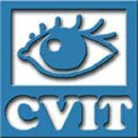

<link rel="stylesheet" href="https://cdn.jsdelivr.net/gh/jpswalsh/academicons@1/css/academicons.min.css">

<link rel="stylesheet" href="https://cdnjs.cloudflare.com/ajax/libs/font-awesome/6.5.0/css/all.min.css">

<!-- ### About me -->

        I am a Research Associate working under <a  href = "https://ece.iisc.ac.in/~pvkece/">Prof. P Vijay Kumar</a> at IISc, Bengaluru. My research focus is Erasure Decoding of Quantum LDPC codes.

        Prior to that, I completed my B.Tech (Hons.) and MS by Research (Dual Degree) in Computer Science and Engineering from <a  href="https://iiit.ac.in/">IIIT Hyderabad</a>. I was working under 
        <a href="https://scholar.google.co.in/citations?user=OEdS9e4AAAAJ&hl=en">Prof. Prasad Krishnan</a> at
        <a href="https://spcrc.iiit.ac.in/">SPCRC</a>, IIIT Hyderabad. My research was primarily focused on 
        developing novel cache-aided communication schemes for distributed data storage systems and content-delivery
        networks.

 		My research interests lie broadly in Coding Theory (both Classical and Quantum). I enjoy working on
        problems that are algebraic, algorithmic, or combinatorial in nature.

  Details about my research work are available <a href="/Research/">here.</a> I (plan to) write up about things that I learn in <a href="/blogs/">my blog.</a>

 

  
<a href="https://scholar.google.com/citations?user=fQ7Kb44AAAAJ&hl=en" title="Google Scholar"><i class="ai ai-google-scholar ai-2x"></i></a>

  
<a href="mailto:vaishyaabhinav@gmail.com" title="Email">
  <i class="fas fa-envelope fa-2x"></i></a>

  
<a href="https://twitter.com/awbhinav" target="_blank" title="X (formerly Twitter)">
  <i class="fab fa-x-twitter fa-2x"></i></a>

### Timeline
<table style="width:100%;border:0px;border-spacing:0px;border-collapse:separate;margin-right:auto;margin-left:0px;border: 1px solid black;border-color: black;"><tbody>
            <tr>
            <td style="padding:10px;width:100%;vertical-align:middle;background-color: #cfe2ff">
              <!-- <heading style="color: #084298;">News</heading> -->
              <ul>
                <li style="color: #084298;"><strong><em> April 2025: </em></strong>Attended the school and workshop on <a href="https://www.icts.res.in/program/HDXandCodes">HDXs and Codes </a> at ICTS, Bengaluru.</li>
                <li style="color: #084298;"><strong><em> April 2025: </em></strong>Our paper <a href="https://arxiv.org/abs/2504.21845">On the Efficacy of the Peeling Decoder for the Quantum Expander Code</a> got accepted at ISIT, 2025.</li>
                <li style="color: #084298;"><strong><em> January 2024: </em></strong>Auditing the course <a href="https://ece.iisc.ac.in/~nkashyap/E2_210/">Quantum Error-Correcting Codes </a> taught by <a href="https://ece.iisc.ac.in/~nkashyap/">Prof. Navin Kashyap </a> at IISc, Bengaluru.</li>
              	<li style="color: #084298;"><strong><em> September 2023: </em></strong>Our paper <a  href="https://arxiv.org/abs/2302.03452">Cache-Aided Communication Schemes via Combinatorial Designs and their q-analogs</a> got accepted for publication in IEEE Journal on Selected Areas in Information Theory (JSAIT), 2023.</li>
                <li style="color: #084298;"><strong><em> July 2023: </em></strong>Started working under <a  href = "https://ece.iisc.ac.in/~pvkece/"> Prof. P Vijay Kumar </a> at IISc, Bengaluru.</li>
                <li style="color: #084298;"><strong><em> June 2023: </em></strong>Defended my Master's Thesis, titled <em>"Low Complexity Cache-Aided Communication Schemes for Distributed
				Data Storage and Distributed Computing". </em>[<a href="files/Thesis_Defense_Abhinav.pdf">Slides</a>]</li>
                <li style="color: #084298;"><strong><em> June 2023: </em></strong>Attended the <a  href = "https://ece.iisc.ac.in/~jtg/2023/index.html">JTG/IEEE ITSoc Summer School 2023 </a> at IISc, Bengaluru.</li>
                <!-- <li style="color: #084298;"><strong><em> January 2023: </em></strong>Our paper <a  href="https://arxiv.org/abs/2302.03452">Cache-Aided Communication Schemes via Combinatorial Designs and their q-analogs</a> is now on arXiv.</li> -->
                <li style="color: #084298;"><strong><em> January 2023: </em></strong>Started working as a Teaching Assistant for the course Information-Theoretic Methods in Computer Science at IIIT-H.</li>
                <li style="color: #084298;"><strong><em> November 2022: </em></strong>Presented our paper <a  href="https://ieeexplore.ieee.org/abstract/document/9965756">Coded Data Rebalancing for Distributed Data Storage Systems with Cyclic Storage</a> at  <a href = "https://itw2022.in/">ITW, 2022.</a> [<a href="files/ITW2022_CDR_Presentation.pdf">Slides</a>]</li>
                <li style="color: #084298;"><strong><em> August 2022: </em></strong>My first paper got accepted at <a href = "https://itw2022.in/">ITW, 2022.</a></li>
				</ul> 
            </td>
          </tr>
        </tbody></table>

### Research Experience
<table style="width:100%;border-spacing:0px;border-collapse:separate;margin-right:auto;margin-left:0;border: 1px;background-color: white;border-color: white;"><tbody>
          <!--  Project Associate at IISc  -->
          <tr>
            <td style="width:30%;vertical-align:middle;border-color: white;background-color: white;max-width: 200px;min-width: 160px; max-height: 200px; min-height: 160px"> </td>
            <td style="padding-left: 90px;width:70%;vertical-align:middle;border-color: white;background-color: white;">
              <strong>Indian Institute of Science (IISc), Bengaluru</strong>
               
                Research Associate under <a  href = "https://ece.iisc.ac.in/~pvkece/">Prof. P Vijay Kumar</a>
               
                 Bengaluru &nbsp; · &nbsp; <em> July 2023 - Present  </em>
                
              <ul>
                <li> Quantum Error-Correcting Codes </li>
              </ul>
            </td>
          </tr>
          <!-- Research intern at TUM                -->
          <tr>
            <td  style="width:30%;vertical-align:middle;margin-left: auto; margin-right: auto;border-color: white;background-color: white"></td>
              <td style="padding-left: 90px;width:70%;vertical-align:middle;border-color: white;background-color: white;">
              <strong>Technical University of Munich</strong>
               
                Research Intern under <a href="https://sites.google.com/site/rawadbitar1/">Dr. Rawad Bitar</a>
               
                 Remote &nbsp; · &nbsp; <em> June 2022 - June 2023  </em>
                
              <ul>
                <li> Codes for Distributed Storage </li>
                <li> Coding Theory for Blockchains </li>
              </ul>
            </td>
          </tr>
          <tr>
            <td style="width:30%;vertical-align:middle;margin-left: auto; margin-right: auto;border-color: white;background-color: #fff"></td>
              <td style="padding-left: 90px;width:70%;vertical-align:middle;border-color: white;background-color: white;">
              <strong>Signal Processing and Communications Research Center, IIIT-H</strong>
               
                Researcher under <a href="https://scholar.google.co.in/citations?user=OEdS9e4AAAAJ&hl=en">Prof. Prasad Krishnan</a>
               
                 Hyderabad &nbsp; · &nbsp; <em> Aug 2020 - May 2023  </em>
                
              <ul>
                <li> Coded Caching </li>
                <li> Coded Data Rebalancing </li>
             </ul>
            </td>
          </tr>
          <!-- <tr>
            <td style="padding-left:40px;padding-top:50px;padding-bottom:50px;width:30%;vertical-align:middle;margin-left: auto; margin-right: auto;border-color: white;background-color: #fff"></td>
              <td style="padding-left: 50px;width:70%;vertical-align:middle;border-color: white;background-color: white;">
              <strong>Center for Visual Information Technology, IIIT-H</strong>
               
                Undergraduate Researcher under <a href="https://scholar.google.co.in/citations?user=oLJTcXIAAAAJ&hl=en">Prof. Ravi Kiran Sarvadevabhatla</a>
               
                 Hyderabad &nbsp; · &nbsp; <em> May 2019 - Jun 2020  </em>
                
              <ul>
                <li>A software framework for annotation and analysis of manuscript document images (showcased at a workshop, ICDAR, 2019)</li>
              </ul>
            </td>
          </tr>    -->
</tbody>
</table>

### Work Experience
<table style="width:100%;border:0px;border-spacing:0px;border-collapse:separate;margin-right:auto;margin-left:0;border: 0px white;background-color: #cfe2ff;border-color: white;"><tbody>
          <!-- TA -->
          <tr>
            <td style="width:30%;vertical-align:middle;border-color: white;background-color: white;max-width: 200px;min-width: 160px; max-height: 200px; min-height: 160px"> </td>
            <td style="padding-left: 50px;width:70%;vertical-align:middle;border-color: white;background-color: white;">
              <strong>International Institute of Information Technology, Hyderabad (IIIT-H)</strong>
               
                Teaching Assistant
               
                 Hyderabad &nbsp; · &nbsp; <em> Jan 2023 - May 2023 </em> &nbsp; · &nbsp; <em> Feb 2022 - May 2022  </em> &nbsp; · &nbsp; <em> Mar 2021 - May 2021  </em>
                
              <ul>
                <li>Information-Theoretic Methods in Computer Science, Spring '23 </li>
                <li> Introduction to Coding Theory, Spring '22 </li>
                <li> Linear Algebra, Spring '21 </li>
              </ul>
            </td>
          </tr>  
          <!-- Problem Setter at Hackerrank -->
          <tr>
            <td style="width:30%;vertical-align:middle;margin-left: auto; margin-right: auto;border-color: white;background-color: #fff"></td>
            <td   style="border-color: white;background-color: #fff;padding-right:0px;padding-left: 50px">
              <strong>Hackerrank</strong>
               
                Problem Setter
               
                 Remote &nbsp; · &nbsp; <em> Jun 2019 - Oct 2019 </em>
                
              <ul>
              <li> Prepared various original programming and algorithmic problems along with strong testcases.</li>
            </ul>
            </td>
          </tr>  
      </tbody>
  </table>

### Education
<table style="width:100%;border:0px;border-spacing:0px;border-collapse:separate;margin-right:auto;margin-left:0;border: 0px white;background-color: #cfe2ff;border-color: white;"><tbody>
          <!-- TA -->
          <tr>
            <td style="width:30%;vertical-align:middle;border-color: white;background-color: white;max-width: 200px;min-width: 160px; max-height: 200px; min-height: 160px"> </td>
            <td style="padding-left: 50px;width:70%;vertical-align:middle;border-color: white;background-color: white;">
              <strong>International Institute of Information Technology, Hyderabad (IIIT-H)</strong>
               
                Bachelor of Technology (Honours) and Master of Science by Research in
                Computer Science and Engineering
               
                 Hyderabad &nbsp; · &nbsp; <em> July 2018 - June 2023 </em>
                
              <ul>
                <li>Advisor: <a href="https://scholar.google.co.in/citations?user=OEdS9e4AAAAJ&hl=en">Dr. Prasad Krishnan</a></li>
              <li> Thesis Title: Low Complexity Cache-Aided Communication Schemes for Distributed Data Storage and Distributed Computing </li>
              <li> Specialization: Algorithms and Theory [<a href="files/specialization.pdf">Certificate</a>]</li>
            </ul>
            </td>
          </tr>  
      </tbody>
  </table>

